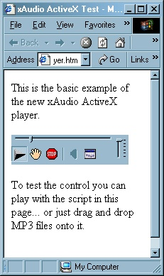



## MP3 Player ActiveX \(xAudio\) Control \- no more Windows Media player

### Description

This download contains an ActiveX control project created in Visual Basic that implements a simple MP3 player using the xAudio library. The quick story on xAudio is, last year the software was purchased by InterTrust, and since then, the SDK for the library has been unavailable. While I eventually did find an older copy of the SDK, my work that you see here is based on a post I found in Planet Source Code.

http://www.planetsourcecode.com/vb/scripts/ShowCode.asp?txtCodeId=24534&lngWId=1

The zip contains a couple of dlls. The xAnalyze, xAudio, and apigid32 dlls are all static DLLs and are placed in the \Windows\System directory of your computer. The file jeffActiveXStaticDLL.dll is an ActiveX dll that must be registered with RegSvr32.exe. While I am not making the source code available for this dll, I can tell you that all it contains is the subclasser and hook modules from vbAccelerator.

Subclassing is required for the implementation of the player, so you could use the subclassing approach used in Gene's article, but I think you will find vbAccelerator's approach to subclassing (and my approach in this control) much better and easier to work with and debug.

At the time of this posting, I've tested the control in VB, FrontPage, and Visual Interdev. It is a simple player, offering up a handful of what I consider to be critical events from a player. The control has a .Play method that accepts either a filename or a url. The position slider is working, as are pause and stop. I've tested it pretty thoroughly thus far.

However, there are a couple of items I should mention. First, the volume and mixer have not been implemented yet. You can use the PSC project to see how these items are to be implemented. Second, I'm having some difficulty detecting an error when a bad mp3 file is sent to the player. Doing this does not generate any errors currently, the player simple starts then stops as soon as a Play command is issued. I haven't yet been able to detect whether the library is sending any kind of file format error notification or not.

That said, this is a basic, stable player... and it will free your app from any dependencies on Windows Media player stuff. Since from this point forward, I will be including additional dependencies in this control, here's where I've decided to break off a chunk to share.

So download a copy today... and get started on your own custom MP3 player control. =)

Don't forget to VOTE if you like this. =)

http://www.vbaccelerator.com/codelib/ssubtmr/ssubtmr.htm

http://www.vbaccelerator.com/codelib/hook/vbalhook.htm
 
### More Info
 

             |
---                |---
**Submitted On**   |2002-06-26 12:13:48
**By**             |[TheFrogPrince](https://github.com/Planet-Source-Code/PSCIndex/blob/master/ByAuthor/thefrogprince.md)
**Level**          |Advanced
**User Rating**    |4.7 (28 globes from 6 users)
**Compatibility**  |VB 6\.0
**Category**       |[OLE/ COM/ DCOM/ Active\-X](https://github.com/Planet-Source-Code/PSCIndex/blob/master/ByCategory/ole-com-dcom-active-x__1-29.md)
**World**          |[Visual Basic](https://github.com/Planet-Source-Code/PSCIndex/blob/master/ByWorld/visual-basic.md)
**Archive File**   |[MP3\_Player990676262002\.zip](https://github.com/Planet-Source-Code/thefrogprince-mp3-player-activex-xaudio-control-no-more-windows-media-player__1-36291/archive/master.zip)

